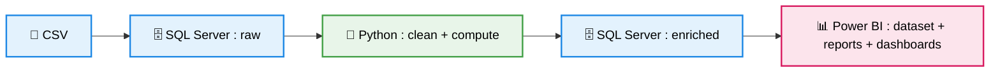

# Pipeline de Données Capteurs Industriels & Détection d'Anomalies

> Pipeline automatisé de données industrielles assurant ingestion, transformation, stockage et visualisation, avec détection d’anomalies par Z-Score pour la maintenance préventive.


---

## 🎯 Objectifs métier 

- Détecter automatiquement les anomalies capteurs avant défaillance équipement 
- Superviser plusieurs équipements industriels via dashboard interactif
- Comparer les performances entre machines et capteurs
- Automatiser bout en bout via Windows Task Scheduler

---

## ⚡ Points clés

- Pipeline ETL automatisé
- Architecture : SQL RAW → Python → SQL BI
- Détection d’anomalies statistique `Z-score` (|Z| > 3)
- Dashboard interactif Power BI

---

## 🔁 Pipeline


---

## 📊 Données

| Métrique | Valeur |
|---|---|
| Observations | 2 000 |
| Équipements surveillés | 4 (échangeur, compresseur, turbine, pompe) |
| Types de capteurs | 3 (température, débit, pression) |
| Seuil d'anomalie | \|Z\| > 3 |

---

## ⚙️ Stack technique

- **Python** : pandas, scipy
- **Base de données** : SQL Server
- **BI** : Power BI
- **Automatisation** : Task Scheduler

---

## 🔬 Méthode

Les anomalies sont détectées par **Z-Score** défini par :

```python
df['z_score'] = df.groupby(['machine', 'capteur'])['valeur'] \
    .transform(lambda x: (x - x.mean()) / x.std())
df['anomalie'] = df['z_score'].abs() > 3
```

---

## 📈 Résultats clés

- Détection fiable des anomalies capteurs
- Visualisation claire via dashboard interactif
- Exécution planifiée sans intervention manuelle via Windows Task Scheduler 

---

## 📊 Visualisations

<p align="center">


<em><b>Heatmap de consommation :</b> On observe clairement une rupture de charge le week-end sur le compteur tertiaire, typique d'une gestion programmée du bâtiment (HVAC), contrairement au profil industriel plus stable.</em>
</p> 
 
<!-- Ajouter une capture du dashboard Power BI ici -->
<!--  -->
 

---

## ▶️ Exécution

### Prérequis

- Python 3.10+
- SQL Server Developer Edition
- Power BI Desktop
- ODBC Driver 18

### Comment exécuter

```bash
# Cloner le dépôt
git clone https://github.com/fatehchaabat/industrial-sensor-data-pipeline.git
cd industrial-sensor-data-pipeline

# Installer les dépendances
pip install -r requirements.txt

# Lancer le pipeline complet (extraction → transformation → chargement)
python extraction_transform_load_full.py

```
### Configuration SQL Server
La connexion utilise l’authentification Windows. Adapter les paramètres suivants dans le script :

```python
from sqlalchemy import create_engine

engine = create_engine(
    "mssql+pyodbc://<SERVEUR>/<NOM_BASE>"
    "?driver=ODBC+Driver+18+for+SQL+Server"
    "&trusted_connection=yes"
    "&Encrypt=no"
)
```
 
### Connexion Power BI
 
Ouvrir `dashboard.pbix` → Transformer les données → Mettre à jour la chaîne de connexion SQL Server.

---
 
## 📁 Structure du projet
 
```
industrial-sensor-pipeline/
├── data/
│   └── sensors_raw.csv                    # données simulées
├── sql/
│   ├── create_tables.sql                  # schéma DB
│   └── queries.sql                        # requêtes analytiques 
├── results/
│   └── 03_heatmap_power.png                     
├── extraction_transform_load_full.py      # pipeline complet ETL
├── dashboard.pbix                         # Power BI dashboard
└── requirements.txt
```

---

## ⚠️ Limites actuelles
- Pas d'ingestion streaming en temps réel (Kafka)
- Aucune notification automatique en cas d'anomalie détectée, faisable simplement via `smtplib` (email) ou une API Slack
- Aucune gestion native des erreurs et dépendances entre étapes (Airflow)
- Power BI Desktop uniquement, pas de partage en ligne sans licence Power BI Pro
- Les performances de détection restent à valider sur des données industrielles réelles

---

## 🔮 Améliorations futures
 
- Pipeline incrémental avec traitement uniquement des nouvelles données à chaque exécution, sans recharger l'historique complet
- Gestion des dépendances et des erreurs entre étapes via Airflow ou Prefect
- Notification automatique (email, Slack) lors de la détection d'une anomalie critique
- Publication en ligne et actualisation automatique des données sans intervention manuelle
- Remplacement du batch par un pipeline streaming via Kafka ou Spark Streaming


---

## 📄 Licence

MIT · [Fateh Chaabat](https://fatehchaabat.github.io)


