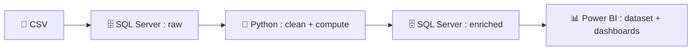
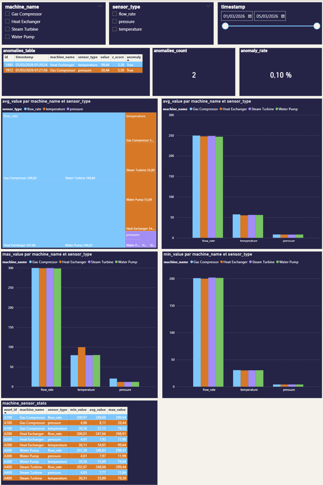

# Pipeline de Données Capteurs Industriels & Détection d'Anomalies

> **Simulation d’un pipeline industriel de supervision capteurs avec détection d’anomalies et automatisation complète**


---

## 🚀 Vue d'ensemble

Ce projet simule un système industriel réel de supervision et de maintenance prédictive basé sur des données capteurs.



| Métrique | Valeur |
|---|---|
| Observations | 2 000 |
| Équipements surveillés | 4 (Échangeur thermique, Compresseur, Turbine, Pompe) |
| Types de capteurs | 3 (Température, Débit, Pression) |
| Seuil d'anomalie | \|Z\| > 3 |

---

## 🎯 Objectifs métier

- Détection précoce des dérives capteurs
- Supervision multi-équipements via dashboard interactif
- Analyse comparative machines / capteurs
- Automatisation complète du pipeline via Windows Task Scheduler

---

## ⚙️ Stack technique

| Composant              | Rôle                               |
| ---------------------- | ---------------------------------- |
| Python (pandas, scipy) | Traitement & détection d’anomalies |
| SQL Server             | Stockage (raw + enriched)          |
| Power BI               | Visualisation & reporting          |
| Task Scheduler         | Automatisation                     |

---

## 🔬 Méthode

Les anomalies sont détectées via le **Z-Score**, calculé par machine et capteur.

Une observation est considérée comme anormale si **|Z| > 3**, soit au-delà de **trois écarts-types** (≈ 0,3 % des cas).

```python
df["z_score"] = df.groupby(["machine_name", "sensor_type"])["value"].transform(
    lambda x: (x - x.mean()) / x.std() if x.std() != 0 else 0)
df["anomaly"] = df["z_score"].abs() > 3
```

---

## 📈 Résultats & Visualisations

### Résultats clés

| Métrique | Valeur |
|---|---|
| Anomalies détectées | 2 |
| Taux d'anomalie | 0,1 % |
| Temps d’exécution | < 3s |


### Fonctionnalités du dashboard

- Filtres dynamiques : machine, capteur, timestamp  
- KPI : nombre et taux d’anomalies  
- Table détaillée des anomalies  
- Treemap : moyenne par machine et capteur  
- Histogrammes : min / max / moyenne  
- Tableau de synthèse global  

<p align="center">

</p>

---

## 🏭 Applications

- Supervision industrielle
- Maintenance conditionnelle
- Monitoring énergétique
- Analyse de performance équipements
- Systèmes de type SCADA

---

## ⚠️ Limites actuelles
 
- Traitement batch uniquement — pas de streaming temps réel (Kafka)
- Pas d'orchestration — aucune gestion des erreurs entre étapes (Airflow)
- Alerting absent — faisable via `smtplib` ou API Slack
- Power BI Desktop uniquement — partage en ligne nécessite une licence Pro
- Données simulées — à valider sur données réelles

---

## 🚀 Améliorations possibles

- Intégration temps réel (MQTT / Kafka)
- Déploiement cloud (Azure / AWS)
- Orchestration avancée (Airflow)
- Dashboard temps réel

---

## 📁 Structure du projet

```
industrial-sensor-data-pipeline/
│
├── README.md                                       # Documentation principale
├── LICENSE                                         # Licence MIT
├── requirements.txt                                # Dépendances Python
├── pipeline.py                                     # Pipeline complet ETL
│
├── data/
│   └── industrial_sensor_data.csv                  # Données simulées
│
├── sql/
│   ├── create_load_table.sql                       # Création et chargement des tables
│   ├── queries.sql                                 # Exploration et validation des données
│   └── check_bi.sql                                # Contrôle qualité post-chargement
│
├── power_bi/
│   └── dashboard.pbix                              # Dashboard Power BI
│
├── results/
│   └── dashboard_preview.png                       # Aperçu du dashboard
│
└── .gitignore                                      # Fichiers exclus du dépôt
```

---

## ▶️ Comment exécuter

```bash
# Cloner le dépôt
git clone https://github.com/fatehchaabat/industrial-sensor-data-pipeline.git
cd industrial-sensor-data-pipeline

# Installer les dépendances
pip install -r requirements.txt

# Lancer le pipeline complet (extraction → transformation → chargement)
python pipeline.py
```

---

## 🖥️ Configuration & Automatisation

###  Configuration SQL Server

La connexion utilise l'authentification Windows. Adapter les paramètres suivants dans le script :

```python
from sqlalchemy import create_engine

engine = create_engine(
    "mssql+pyodbc://<SERVEUR>/<NOM_BASE>"
    "?driver=ODBC+Driver+18+for+SQL+Server"
    "&trusted_connection=yes"
    "&Encrypt=no"
)
```

### Connexion Power BI

Ouvrir `power_bi/dashboard.pbix` → Transformer les données → Mettre à jour la chaîne de connexion SQL Server.

### Automatisation via Windows Task Scheduler

1. Ouvrir **Task Scheduler** → Créer une tâche
2. **Déclencheur** : choisir la fréquence (quotidienne, horaire, etc.)
3. **Action** : lancer un programme
   - Programme : `python`
   - Arguments : `pipeline.py`
   - Démarrer dans : `C:\...\industrial-sensor-data-pipeline`
4. Les logs d'exécution sont tracés automatiquement dans `pipeline.log`

---

## 👤 Auteur

Ingénieur en **mécanique des fluides et systèmes énergétiques**, avec un intérêt pour l'analyse de données, la modélisation et l'optimisation énergétique. [Fateh Chaabat](https://fatehchaabat.github.io)

---

## 📄 Licence

Ce projet est sous **MIT License** – vous pouvez librement utiliser, modifier et partager le code et les fichiers, à condition de conserver la mention du copyright et de la licence.
